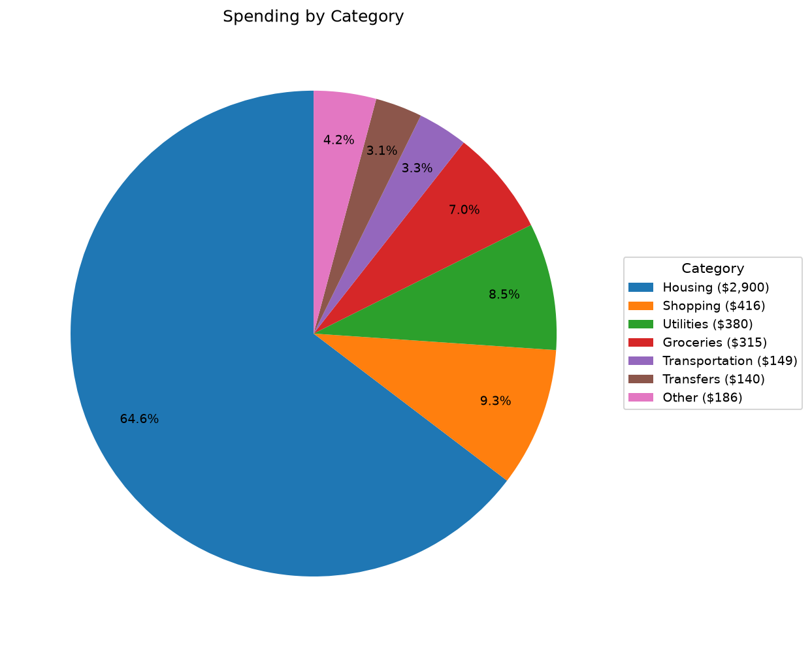
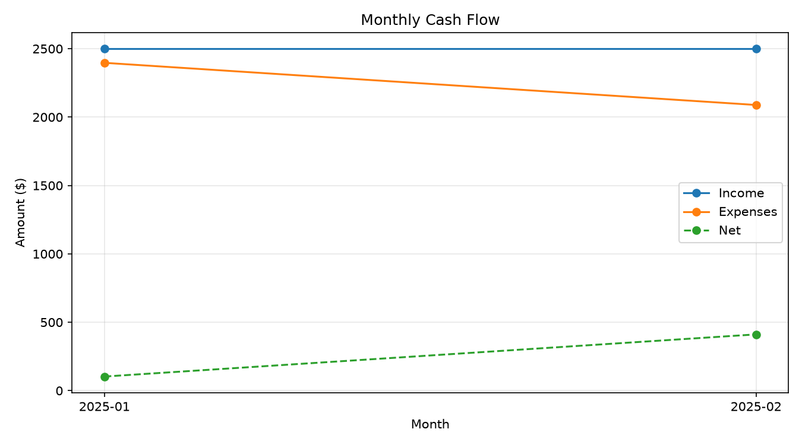

# Personal Finance Tracker

A command-line tool that automatically categorizes bank/credit-card transactions from a CSV export, then generates a spending report with charts — no manual spreadsheet sorting required.

I built this to solve a real annoyance: manually tagging every transaction in a budgeting spreadsheet every month. This script does it in about 2 seconds.

## What it does

1. **Reads** a transaction CSV (the kind you can export from almost any bank).
2. **Categorizes** each transaction using configurable keyword rules (e.g., "STARBUCKS" → `Dining Out`, "NETFLIX.COM" → `Subscriptions`).
3. **Generates**:
   - A categorized CSV you can keep or import elsewhere
   - A Markdown report with income/expense totals, spending by category, top merchants, and month-over-month trend
   - Two charts: a category breakdown pie chart and a monthly cash-flow line chart

## Example output

Running the tool on the included sample data produces a report like:

| Category | Total Spent |
|---|---|
| Housing | $2,900.00 |
| Shopping | $415.63 |
| Utilities | $379.63 |
| Groceries | $315.09 |
| Transportation | $149.15 |

...plus a category breakdown chart and a monthly income vs. expenses trend chart. See `output/report.md` after running the script for the full report.





## Project structure

```
finance-tracker/
├── config/
│   └── categories.yaml       # keyword rules — fully customizable
├── data/
│   └── sample_transactions.csv
├── src/
│   ├── categorizer.py        # keyword-matching categorization logic
│   ├── report.py             # summary tables + chart generation
│   └── tracker.py            # CLI entry point
├── tests/
│   └── test_categorizer.py
├── output/                   # generated CSV, charts, and report land here
├── requirements.txt
└── README.md
```

## Setup

```bash
git clone https://github.com/jrycas90-lgtm/finance-tracker.git
cd finance-tracker
pip install -r requirements.txt
```

## Usage

Run it on the included sample data:

```bash
python src/tracker.py --input data/sample_transactions.csv --output output/
```

Run it on your own exported transactions:

```bash
python src/tracker.py --input path/to/your_transactions.csv --output output/
```

Your CSV needs at minimum these three columns (any extra columns are ignored):

| date | description | amount |
|---|---|---|
| 2025-01-03 | WALMART SUPERCENTER #1234 | -84.32 |
| 2025-01-02 | Direct Deposit PAYROLL | 2500.00 |

Positive amounts are treated as income, negative amounts as expenses.

## Customizing categories

Edit `config/categories.yaml` to add your own categories or keywords — no code changes needed:

```yaml
categories:
  Pets:
    - petco
    - chewy
    - vet clinic
```

Any transaction that doesn't match a keyword falls into `Uncategorized`, and the script will flag how many transactions need attention so you can tune the rules over time.

## Running tests

```bash
pytest tests/
```

## Possible extensions

- Auto-detect bank-specific CSV formats (Chase, Amex, etc. all export slightly differently)
- Add a budget-vs-actual comparison per category
- Swap the static Markdown report for a Streamlit dashboard
- Schedule it to run monthly via cron and email the report

## Tech stack

Python, pandas, PyYAML, matplotlib, pytest

## License

MIT
